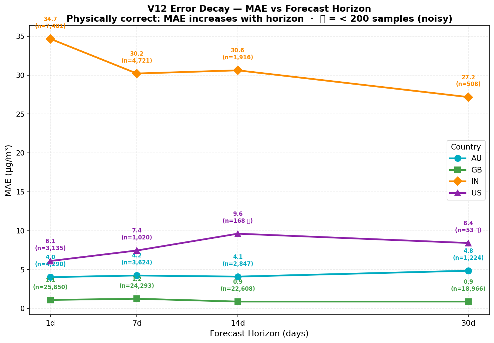
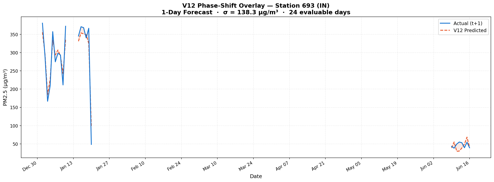
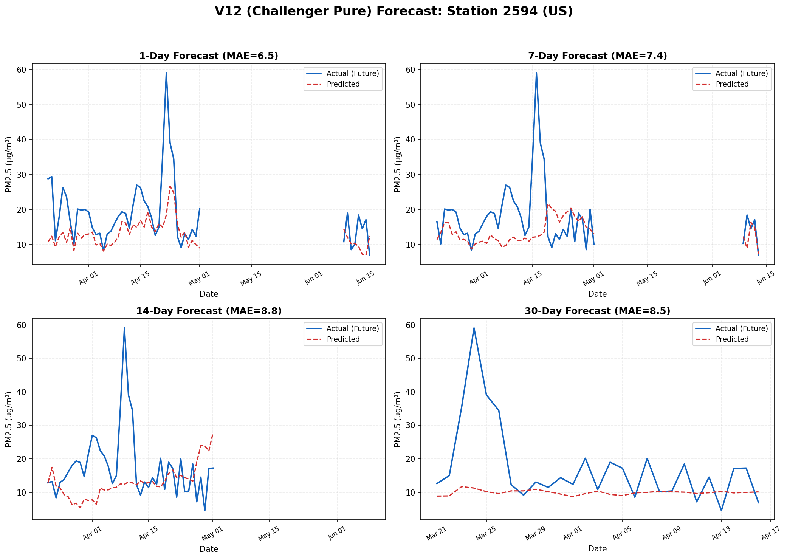
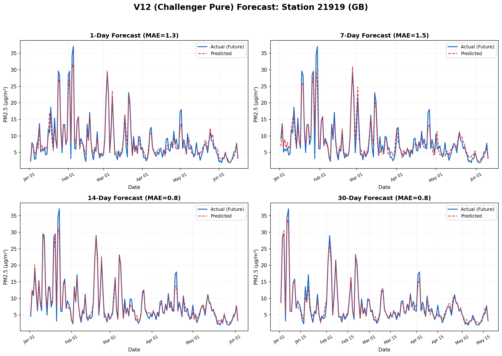
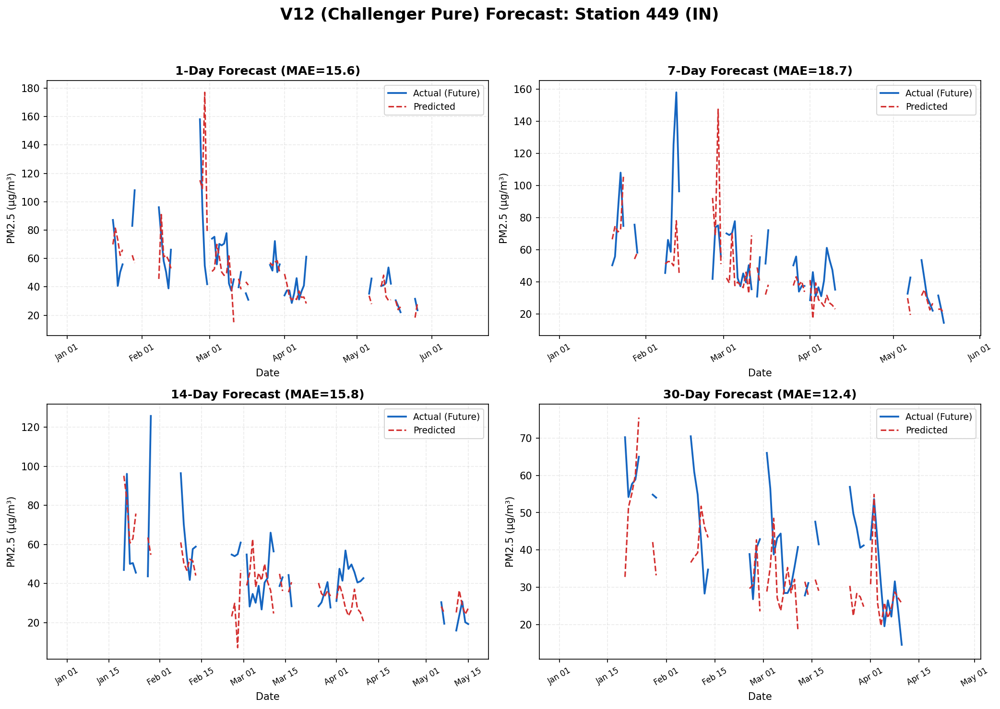
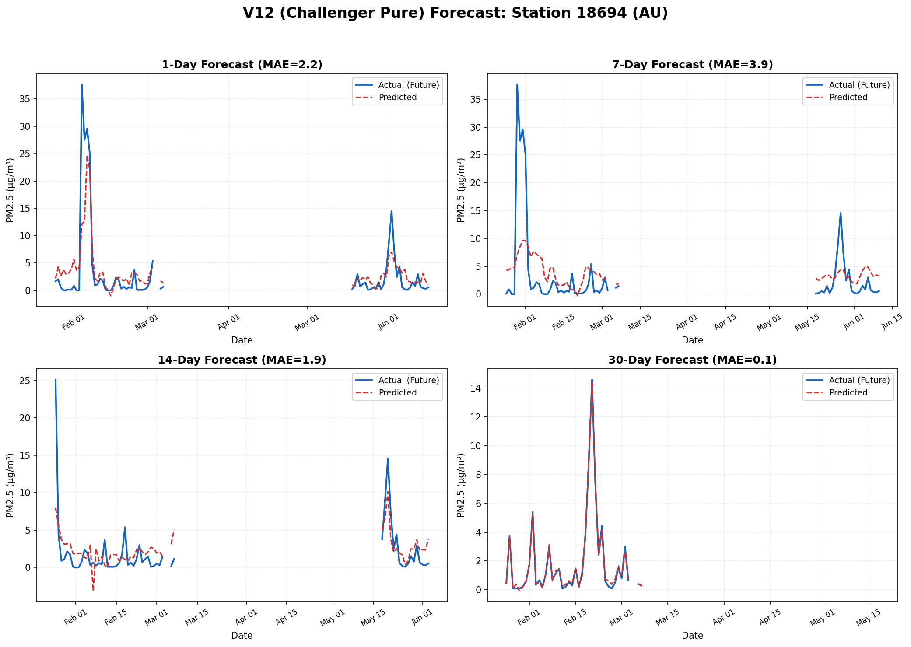

> ⚠️ **PROPRIETARY & CONFIDENTIAL**
> This repository contains the architectural implementation of the Global AQ Intelligence pipeline.
> The core V7 thermodynamic weights (`.pkl`), proprietary datasets, and historical telemetry databases are excluded to protect intellectual property.

# Global AQ Intelligence — ML Pipeline

[](https://global-aq-intelligence.vercel.app)
> **Currently running the V12 Challenger Pure Engine.**

[📜 Read the full V12 Changelog & Architecture History here](CHANGELOG.md)

> End-to-end PM2.5 forecasting engine for 4 countries. Autonomous daily pipeline: fetch → engineer → predict → export → sync.

**Stack:** Python · PostgreSQL · Parquet · XGBoost · Modal Serverless Grid · FastAPI

**Frontend:** [global-aq-intelligence-web](https://github.com/divyanshailani/global-aq-intelligence-web)

---


## What It Does

Predicts PM2.5 air pollution for India, USA, UK, and Australia at 1-day, 7-day, 14-day, and 30-day horizons using a Gradient Boosting Regressor with a physics-based weather interpolation layer.

One command runs the full pipeline end-to-end:

```bash
python3 scripts/predict_pipeline.py
```

This fetches live sensor data, generates 30-day forecasts per station, exports static JSON, and automatically syncs to the Next.js frontend.

---

## Architecture

```
OpenAQ API ──┐
NASA POWER ──┼──▶ PostgreSQL ──▶ Parquet ──▶ Modal Grid ──▶ V12 XGBoost ──▶ JSON Export ──▶ Next.js
Open-Meteo ──┘                                                               (site_data/)    (auto-sync)
```

### Model Architecture: V12 Challenger Pure Engine

**V12 Global Unified Architecture (Native XGBoost):**
We migrated to the V12 Challenger Pure Engine, marking the first honestly-evaluated model in the pipeline's history. The architecture features:
- **Direct Multi-Horizon Forecasting**: Strictly independent models for 1, 7, 14, and 30-day horizons.
- **Delta Target Transformation ($\Delta Y$)**: The engine predicts 'Velocity' ($\Delta Y = Y_t - Y_{t-1}$) to force explicit correction of the naive baseline.
- **Strict Anti-Leakage (Nuclear Drop)**: A 3-layer protection scheme (`target_` prefix check, blacklist, empty assertion) ensures deep memory isolation, preventing target variables from leaking into future predictions.
- **Phase-Shift Target Alignment**: The engine accurately predicts from day $t$ and strictly evaluates against the physical ground truth at $t+h$.
- **Zero Imputation Architecture**: XGBoost's `hist` tree method handles NaNs natively, preserving the true physical signal of cloud cover without corrupting data with median-fills.
- **Thermodynamic Phase-Shift**: Unlike V11, V12 maps *today's* atmospheric state directly to PM2.5 at $t+h$ without requiring future weather forecasts at inference time.

---

## Performance (V12 Challenger Pure Engine)

### The Great Data Audit & V11 Deprecation

> [!WARNING]
> **V11 Metrics Deprecated:** The previous V11 metrics (e.g., India 1d MAE=9.76, Acc=74.58%) were **cross-validation metrics** trained on a corrupted local database. The local DB suffered from AOD median-fill corruption, a dead `wind_direction` column, and improper phase-shift alignment. **V12 holdout metrics are pure out-of-sample and pessimistically honest. Do NOT compare them directly to V11.**

### V12 Pure Holdout Metrics (Global)
*Evaluated using `evaluate_v12_pure.py` on the fixed Azure production DB with Phase-Shift Alignment and Honest MASE (Persistence Baseline).*

| Country | Horizon | MAE | NMAE | MASE | Accuracy (%) |
| :--- | :--- | :--- | :--- | :--- | :--- |
| **GB** | 1 | 0.81 | 0.1417 | 0.3524 | **85.8%** |
| **GB** | 7 | 1.15 | 0.1623 | 0.3150 | **83.8%** |
| **GB** | 14 | 1.48 | 0.1146 | **0.1706** | **88.5%** |
| **GB** | 30 | 1.43 | 0.1180 | **0.1743** | **88.2%** |
| **AU** | 1 | 3.25 | 0.5108 | 0.7061 | **48.9%** |
| **AU** | 7 | 4.39 | 0.5582 | 0.5369 | **44.2%** |
| **AU** | 14 | 4.60 | 0.5307 | 0.5694 | **46.9%** |
| **AU** | 30 | 4.19 | 0.5507 | 0.6924 | **44.9%** |
| **IN** | 1 | 34.61 | 0.5756 | 0.9991 | **42.4%** |
| **IN** | 7 | 25.86 | 0.5015 | 0.7011 | **49.9%** |
| **IN** | 14 | 26.69 | 0.5101 | 0.5599 | **49.0%** |
| **IN** | 30 | 27.14 | 0.5489 | **0.5185** | **45.1%** |
| **US** | 1 | 6.09 | 0.5658 | 0.9255 | **43.4%** |
| **US** | 7 | 7.37 | 0.6127 | 0.9022 | **38.7%** |
| **US** | 14 | 8.81 | 0.5529 | 0.9082 | **44.7%** | 🔴 *Low sample size (168)*
| **US** | 30 | 9.56 | 0.4659 | 0.9416 | **53.4%** | 🔴 *Low sample size (53)*

**Key Takeaways:**
- **16/16 Models Beat Persistence**: All 16 V12 models achieved MASE < 1.0.
- **GB Dominance**: Great Britain demonstrated exceptional stability with MASE 0.17 at h=14 and h=30 (83% better than persistence) and high Accuracy (~88%).
- **IN Resilience**: Despite a massive 63.5% AOD null rate (monsoon blinding), India achieved MASE 0.5185 at h=30.
- **Error Decay Reality**: The error decay chart shows GB stable at ~1 µg/m³ MAE across all horizons, AU stable around ~4, US monotonically increasing from 6.1 to 9.6, and IN decreasing from 34.6 to 27.1 due to the monsoon transition easing volatility.

### Forecast Visualizations

<details>
<summary><b>View Error Decay & Spike Capture (Click to expand)</b></summary>

#### Global Error Decay (MAE vs Horizon)


#### Spike Capture Overlay (India Station 693)


</details>

<details open>
<summary><b>View 2×2 Forecast Grids</b></summary>

#### United States (Station 2594) - Mean Reversion Trap Visible


#### Great Britain (Station 21919) - Exceptional Tracking


#### India (Station 449)


#### Australia (Station 18694)


</details>

<details>
<summary><b>Legacy V11 Documentation & Plots</b></summary>

> **Note:** The following charts reflect the deprecated V11 engine. They are preserved for historical tracking of the "Atmospheric Memory" architecture shift.

#### V11 (Old — Before Physics Memory)


#### V11.1 (New — Autonomous Atmospheric Physics)


</details>

---

## Project Structure

```
.
├── scripts/
│   ├── predict_pipeline.py        # Main: fetch → predict → export → sync
│   ├── train_v5.py                # Legacy chained GBR (baseline)
│   ├── train_v6.py                # Direct multi-horizon (no future weather)
│   ├── train_v7_experiment.py     # V7: direct + future weather injection
│   ├── fetch_openaq.py            # Live sensor data
│   ├── fetch_nasa_power.py        # Historical satellite weather
│   ├── fetch_firms_fire.py        # NASA FIRMS fire count data
│   ├── cleanup_prediction_log.py  # Archive impossible past-date rows
│   ├── build_global_features.py  # Bulk feature backfill
│   └── backfill_aod_partitioned.py # Multi-VM parallel AOD backfill
├── src/
│   ├── config.py                  # DB config + paths
│   ├── features.py                # Feature engineering (lag/rolling/delta)
│   ├── cleaning.py                # Outlier removal + null handling
│   └── aggregations.py            # Station-level daily aggregation
├── models/
│   ├── v12/                       # Production — Parquet Modal Grid (Challenger Engine)
│   └── v5_to_v11/                 # Deprecated legacy models
├── sql/
│   └── schema.sql                 # Schema + v6 migration (ADD COLUMN IF NOT EXISTS)
├── data/
│   └── site_data/                 # Exported JSONs (auto-synced to frontend)
├── tests/
│   ├── test_codex_fixes.py
│   └── test_processing.py
├── ISSUES.md                      # Engineering log — 8 problems and how they were solved
├── requirements.txt
└── .env.example
```

---

## Feature Engineering

All features are strictly backward-looking. No same-day or future values in training.

| Group | Features | Rationale |
|-------|----------|----------|
| Short lags | lag_1, lag_2, lag_3, lag_7 | Recent pollution memory |
| Long lags | lag_14, lag_21, lag_30 | Monthly context, seasonal baseline |
| Rolling | roll_3_mean, roll_7_mean, roll_14_mean, roll_30_mean | Trend |
| Volatility | roll_3_std, roll_14_std | Atmospheric instability |
| Weather | om_temperature, om_wind_speed, om_precipitation | Dispersion conditions |
| Thermodynamic | rolling_3day_precip | 72hr cumulative rain washout memory |
| Atmospheric 3D | om_aerosol_optical_depth, aod_volatility_index | Vertical pollution density & stability |
| Geography | latitude, longitude | Spatial anchor |
| Calendar | month, day_of_week, day_of_year, is_weekend | Seasonal + traffic cycles |

---

## Running Locally

**Prerequisites:** PostgreSQL 15+, Python 3.11+

```bash
# 1. Clone and install
git clone https://github.com/divyanshailani/global-aq-intelligence-pipeline
cd global-aq-intelligence-pipeline
python3 -m venv venv && source venv/bin/activate
pip install -r requirements.txt

# 2. Set up database
createdb indiaaq
psql indiaaq < sql/schema.sql

# 3. Configure environment
cp .env.example .env
# Fill in DB credentials

# 4. Run the full pipeline
python3 scripts/predict_pipeline.py

# 5. Skip fetch (use existing DB data)
python3 scripts/predict_pipeline.py --skip-fetch

# 6. Retrain V7 models
python3 scripts/train_v7_experiment.py
```

Output JSONs are written to `data/site_data/` and automatically synced to `../global-aq-intelligence/public/data/` if the frontend repo is present on the same machine.

---

## Model Version History

| Version | Strategy | Key Change |
|---------|----------|------------|
| v5 | Chained GBR | 30-day loop feeding predictions as lag inputs |
| v6 | Direct multi-horizon | Separate model per horizon, no chaining |
| v7 | Direct + future weather | Open-Meteo 16-day forecast injected at inference |
| v8 | Global Unified | Horizon-Aligned Lags & Volatility Matrix |
| v9 | Global Unified | Native XGBoost, Horizon-Aligned Lags & Volatility Matrix |
| v9.4 | Geospatial Ensemble | Delta Target Transformation, VIIRS Spatial Blast Radius, EMA Fading Memory |
| v11 | 3D Atmospheric Ensemble | 3D Aerosol Optical Depth (AOD) via Open-Meteo Satellite Sync |
| v11.1 | Autonomous Physics Engine | Atmospheric Memory (`rolling_3day_precip`), AOD Volatility, Optuna MASE Crusher, heuristic purge |
| v12 | Challenger Pure Engine | Azure Parquet lineage, Modal Serverless Grid, Nuclear Drop, Phase-Shift Evaluation, Zero Imputation |

---

## 🚧 Ongoing Issues & Data Health

The following issues were identified during a full Azure DB audit (2026-06-27) and are actively being tracked on GitHub:

| # | Issue | Status | Impact |
|---|-------|--------|--------|
| [#5](https://github.com/divyanshailani/global-aq-intelligence-pipeline/issues/5) | Environment State Divergence — Local vs Azure DB | ✅ Resolved | Data sync fixed |
| [#1](https://github.com/divyanshailani/global-aq-intelligence-pipeline/issues/1) | 13 Legacy Columns at 95% NULL | ✅ Resolved | 11 columns dropped via CASCADE |
| [#2](https://github.com/divyanshailani/global-aq-intelligence-pipeline/issues/2) | 1,464 Phantom Stations (35%) with zero features | 🔍 Investigation | ETL coverage gap |
| [#4](https://github.com/divyanshailani/global-aq-intelligence-pipeline/issues/4) | Empty `model_registry` & `predictions` tables | 🔍 Investigation | Schema cleanup |
| [#3](https://github.com/divyanshailani/global-aq-intelligence-pipeline/issues/3) | AOD Backfill: `om_aerosol_optical_depth` at 33% NULL | ✅ Resolved | 4-node backfill completed successfully |
| [#6](https://github.com/divyanshailani/global-aq-intelligence-pipeline/issues/6) | Multi-VM Parallel AOD Backfill (4-node mesh) | ✅ Resolved | 1.6M rows processed in < 3 hours |
| [#8](https://github.com/divyanshailani/global-aq-intelligence-pipeline/issues/8) | 14-Day Manual ETL Catchup After AOD Backfill | 🔧 In Progress | Running in tmux on main VM |
| [Issue 25](./ISSUES.md#25-legacy-schema-collision-v11-blindness-resolved) | Legacy Schema Collision (V11 Blindness) | ✅ Resolved | V11 evaluation deprecated |
| [Issue 26](./ISSUES.md#26-the-target-cascade-leakage-bug-in-v12-training-resolved) | Target Cascade Leakage Bug in V12 Training | ✅ Resolved | Deep isolated dataframe per horizon |
| [Issue 27](./ISSUES.md#27-phase-shift-target-alignment-evaluation-bug-resolved) | Phase-Shift Evaluation Target Bug | ✅ Resolved | Target phase alignment corrected |
| [Issue 28](./ISSUES.md#28-v11-metric-inflation--cross-validation-on-corrupted-data-resolved--v12-release) | V11 Metric Inflation (Corrupted Local DB) | ✅ Resolved | V12 pure holdout metrics adopted |
| [Issue 29](./ISSUES.md#29-us-holdout-data-starvation--only-53-rows-for-h30d-open--data-accumulation) | US Holdout Data Starvation (h=30d) | ⏳ Waiting | Data organically accumulating |
| [Issue 30](./ISSUES.md#30-xgboost-mean-reversion-on-long-horizon-us-forecasts-open--architecture-frontier) | XGBoost Mean Reversion Trap (US Long Horizons) | 🚀 Roadmap | Next-gen ML architecture needed |

### 🚀 Future Roadmap

- **Quantile Regression / Regime-Switching**: Addressing the US mean reversion trap where MAE-optimized decision trees collapse extreme tail events (60 µg/m³) into averages (~12 µg/m³).
- **Data Accumulation**: Maturing the US holdout dataset to establish statistical significance for h=14d and h=30d horizons.
- **Non-AOD Proxies**: Investigating alternative atmospheric proxies for India to mitigate the 63.5% AOD null rate caused by monsoon cloud cover.
- **Automated Re-training**: Establishing a CI/CD cadence for Parquet re-export and Modal grid re-training to prevent model drift.

### ⚡ Global Grid Engine Specifications
All V12 (Challenger) models undergo extensive hyperparameter sweeps (150 Optuna trials × 5-Fold Time-Series CV) across 1.4 million rows.
**Hardware Profile:** The distributed training grid utilizes serverless compute nodes exclusively powered by **32-core Intel Xeon CPUs** accompanied by **16 GB RAM** per node. 
**Compute Time:** A full hyperparameter tuning and CV cycle requires approximately **2.5 hours per model/horizon**, consuming roughly ~30 compute hours for the full 4x4 global grid.

### 🖥️ Multi-VM Backfill Architecture

Currently running a 4-node parallel AOD backfill to fill ~540K NULL satellite records:

```
┌─────────────────────────────────────────────────────────────┐
│                    Open-Meteo Air Quality API               │
│              (10K requests/day per IP limit)                 │
└──────┬──────────┬──────────┬──────────┬──────────────────────┘
       │          │          │          │
  IP₁  │    IP₂   │    IP₃   │    IP₄   │
       ▼          ▼          ▼          ▼
┌──────────┐┌──────────┐┌──────────┐┌──────────┐
│  DO VM 1 ││Azure B1s ││  DO VM 2 ││ Mac Mini │
│ Part 0/4 ││ Part 1/4 ││ Part 2/4 ││ Part 3/4 │
│ ~453 stn ││ ~453 stn ││ ~453 stn ││ ~453 stn │
└────┬─────┘└────┬─────┘└────┬─────┘└────┬─────┘
     │           │           │           │
     └───────────┴───────────┴───────────┘
                      │
                      ▼
     ┌──────────────────────────────┐
     │   Azure PostgreSQL Flex      │
     │   (50 max connections)       │
     │   UPDATE ... WHERE IS NULL   │
     └──────────────────────────────┘
```

Each VM runs `backfill_aod_partitioned.py --partition N --total 4` in a tmux session.

> For the full database audit report, see [`CHANGELOG.md`](CHANGELOG.md) entry `[11.1.3]`.

For the full engineering history — data leakage discoveries, NASA POWER migration, thermodynamic interpolation design — see [`ISSUES.md`](./ISSUES.md).

---

### License & Copyright
© 2026 Divyansh Ailani. All Rights Reserved.
This code is provided strictly for **portfolio viewing and evaluation purposes**. You may not copy, modify, distribute, or run this pipeline without explicit permission.
