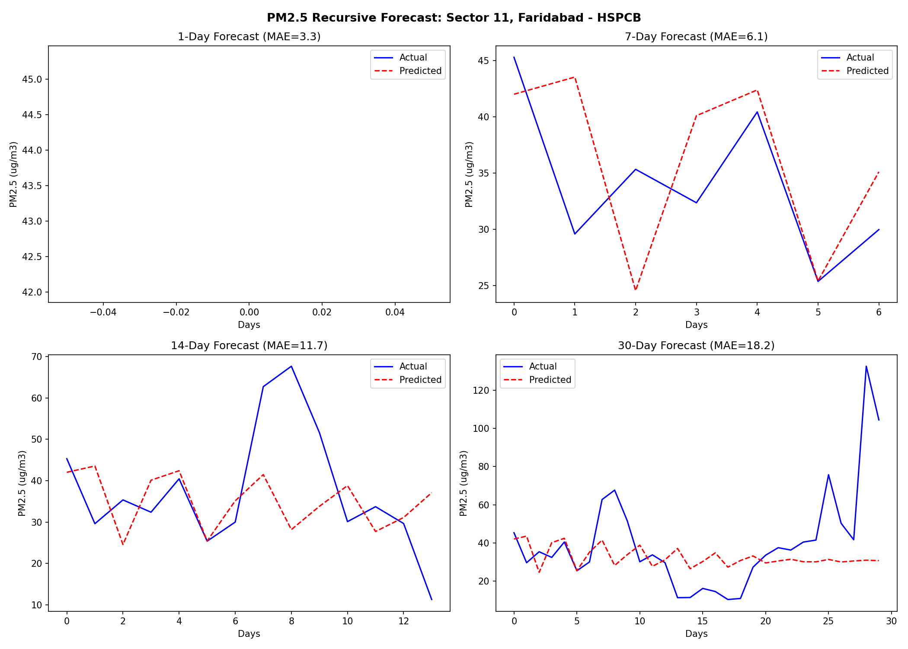

# Global AQ Intelligence — ML Pipeline


> End-to-end PM2.5 forecasting engine for 4 countries. Autonomous daily pipeline: fetch → engineer → predict → export → sync.

**Stack:** Python · PostgreSQL · scikit-learn GBR · NASA POWER · Open-Meteo · FastAPI

**Frontend:** [global-aq-intelligence-web](https://github.com/divyanshailani/global-aq-intelligence-web)

---

## What It Does

Predicts PM2.5 air pollution for India, USA, UK, and Australia at 1-day, 7-day, 14-day, and 30-day horizons using a Gradient Boosting Regressor with a physics-based weather interpolation layer.

One command runs the full pipeline end-to-end:

```bash
python3 scripts/predict_pipeline.py
```

This fetches live sensor data, generates 30-day forecasts per station, exports static JSON, and automatically syncs to the Next.js frontend.

---

## Architecture

```
OpenAQ API ──┐
NASA POWER ──┼──▶ PostgreSQL ──▶ Feature Engineering ──▶ V7 Models ──▶ JSON Export ──▶ Next.js
Open-Meteo ──┘                   (lag/rolling/delta)     (GBR × 16)    (site_data/)    (auto-sync)
```

### Model Architecture: V7 Direct Thermodynamics Engine

The core insight from v5 development: chaining Day-1 predictions into Day-2's lag features compounds error exponentially. By Day-30 the model was predicting noise.

**V7 fix — direct horizon models:**
- Train one independent GBR per horizon per country (4 countries × 4 horizons = 16 models)
- Each model predicts directly from real observed features — no chaining, no error propagation
- Anchor points: h1, h7, h14, h30 are direct model outputs
- Intermediate days (2–6, 8–13, 15–29): weather-weighted interpolation between anchors

**Thermodynamic modifiers applied during interpolation:**
- Rain washout: precipitation > 2mm → PM2.5 reduced 30%
- Wind dispersion: wind > 15 km/h → PM2.5 reduced 15%
- Stagnation spike: wind < 5 km/h + no precip → PM2.5 increased 20%

**V7 feature additions over V6:**
- `future_temp`, `future_wind`, `future_precip` — injected from Open-Meteo 16-day forecast per station per date
- Falls back to station climatology baseline for horizons beyond 15 days

---

## Performance (V7 Thermodynamics Engine)



All metrics on held-out future data — strict chronological split, no leakage.

| Country | Code | R² Score | Mean Absolute Error (MAE) | Real-World Accuracy (NMAE) |
| :--- | :--- | :--- | :--- | :--- |
| **India** | `IN` | 0.750 | 9.26 µg/m³ | **66.1%** |
| **United States** | `US` | 0.499 | 0.84 µg/m³ | **84.1%** |
| **Australia** | `AU` | 0.451 | 1.57 µg/m³ | **70.5%** |
| **United Kingdom** | `GB` | 0.248 | 2.41 µg/m³ | **63.0%** |

> **💡 Architect's Note: The Low-Variance Trap & NMAE**
> You might notice a discrepancy between $R^2$ and MAE in developed nations (like the US and GB). Because their raw PM2.5 levels are extremely low and stable (low variance), the $R^2$ formula mathematically penalizes the model disproportionately for tiny micro-errors. 
>
> To counter this and provide a truthful confidence score for the UI, this engine calculates **Normalized Mean Absolute Error (NMAE)** against the historical mean, converting it into a robust real-world Accuracy %.

**Known weaknesses (tracked in `ISSUES.md`):**
- `value` (today's PM2.5) holds ~82% feature importance for h1 India — the model is a physics-backed persistence model at short range
- US h7 R²=0.14 — a single country-level GBR is too coarse for 1,400 geographically diverse stations
- India h30 overfit delta = 0.45 (train R²=0.88 vs test R²=0.43)

---

## Project Structure

```
.
├── scripts/
│   ├── predict_pipeline.py        # Main: fetch → predict → export → sync
│   ├── train_v5.py                # Legacy chained GBR (baseline)
│   ├── train_v6.py                # Direct multi-horizon (no future weather)
│   ├── train_v7_experiment.py     # V7: direct + future weather injection
│   ├── fetch_openaq.py            # Live sensor data
│   ├── fetch_nasa_power.py        # Historical satellite weather
│   ├── fetch_firms_fire.py        # NASA FIRMS fire count data
│   ├── cleanup_prediction_log.py  # Archive impossible past-date rows
│   └── build_global_features.py  # Bulk feature backfill
├── src/
│   ├── config.py                  # DB config + paths
│   ├── features.py                # Feature engineering (lag/rolling/delta)
│   ├── cleaning.py                # Outlier removal + null handling
│   └── aggregations.py            # Station-level daily aggregation
├── models/
│   ├── v5/                        # Legacy (chained) — kept as baseline
│   ├── v6/                        # Direct horizon — no future weather
│   └── v7/                        # Production — direct + future weather
├── sql/
│   └── schema.sql                 # Schema + v6 migration (ADD COLUMN IF NOT EXISTS)
├── data/
│   └── site_data/                 # Exported JSONs (auto-synced to frontend)
├── tests/
│   ├── test_codex_fixes.py
│   └── test_processing.py
├── ISSUES.md                      # Engineering log — 8 problems and how they were solved
├── requirements.txt
└── .env.example
```

---

## Feature Engineering

All features are strictly backward-looking. No same-day or future values in training.

| Group | Features | Rationale |
|-------|----------|----------|
| Short lags | lag_1, lag_2, lag_3, lag_7 | Recent pollution memory |
| Long lags | lag_14, lag_21, lag_30 | Monthly context, seasonal baseline |
| Rolling | roll_3/7/14/30_mean, roll_3/14_std | Trend + volatility |
| Momentum | pm25_delta_1, pm25_delta_7 | Rising vs falling signal |
| Weather (hist) | temperature, humidity, wind_speed (NASA POWER) | Dispersion conditions |
| Weather (future) | future_temp, future_wind, future_precip (Open-Meteo) | V7 thermodynamics |
| Pollutants | no2, co, o3, so2 (lagged) | Chemical co-occurrence |
| Fire | fire_count (NASA FIRMS) | Wildfire contribution |
| Calendar | month, day_of_week, day_of_year, is_weekend | Seasonal + traffic cycles |

---

## Running Locally

**Prerequisites:** PostgreSQL 15+, Python 3.11+

```bash
# 1. Clone and install
git clone https://github.com/divyanshailani/global-aq-intelligence-pipeline
cd global-aq-intelligence-pipeline
python3 -m venv venv && source venv/bin/activate
pip install -r requirements.txt

# 2. Set up database
createdb indiaaq
psql indiaaq < sql/schema.sql

# 3. Configure environment
cp .env.example .env
# Fill in DB credentials

# 4. Run the full pipeline
python3 scripts/predict_pipeline.py

# 5. Skip fetch (use existing DB data)
python3 scripts/predict_pipeline.py --skip-fetch

# 6. Retrain V7 models
python3 scripts/train_v7_experiment.py
```

Output JSONs are written to `data/site_data/` and automatically synced to `../global-aq-intelligence/public/data/` if the frontend repo is present on the same machine.

---

## Model Version History

| Version | Strategy | Key Change |
|---------|----------|------------|
| v5 | Chained GBR | 30-day loop feeding predictions as lag inputs |
| v6 | Direct multi-horizon | Separate model per horizon, no chaining |
| v7 | Direct + future weather | Open-Meteo 16-day forecast injected at inference |

---

For the full engineering history — data leakage discoveries, NASA POWER migration, thermodynamic interpolation design — see [`ISSUES.md`](./ISSUES.md).
