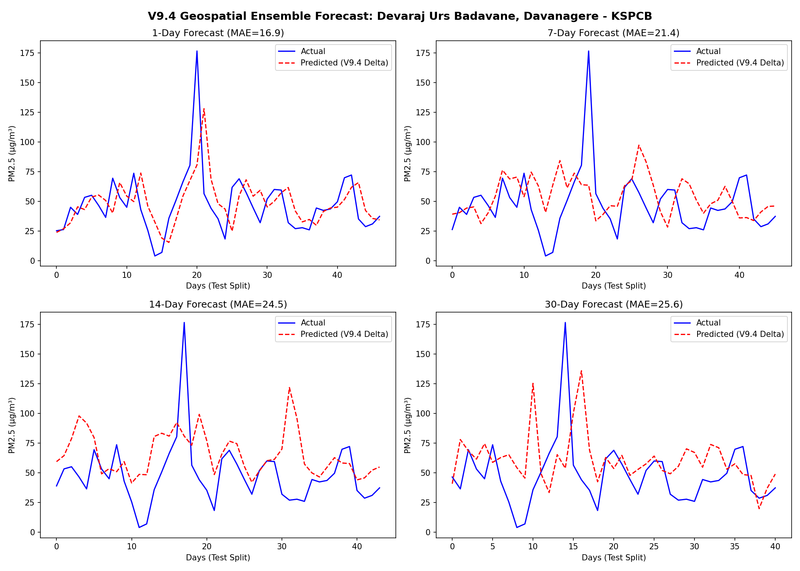

> ⚠️ **PROPRIETARY & CONFIDENTIAL**
> This repository contains the architectural implementation of the Global AQ Intelligence pipeline.
> The core V7 thermodynamic weights (`.pkl`), proprietary datasets, and historical telemetry databases are excluded to protect intellectual property.

# Global AQ Intelligence — ML Pipeline

[](https://global-aq-intelligence.vercel.app)
> **Currently running the V11 3D Atmospheric Ensemble Router.**

[📜 Read the full V11 Changelog & Architecture History here](CHANGELOG.md)


> End-to-end PM2.5 forecasting engine for 4 countries. Autonomous daily pipeline: fetch → engineer → predict → export → sync.

**Stack:** Python · PostgreSQL · scikit-learn GBR · NASA POWER · Open-Meteo · FastAPI

**Frontend:** [global-aq-intelligence-web](https://github.com/divyanshailani/global-aq-intelligence-web)

---


## What It Does

Predicts PM2.5 air pollution for India, USA, UK, and Australia at 1-day, 7-day, 14-day, and 30-day horizons using a Gradient Boosting Regressor with a physics-based weather interpolation layer.

One command runs the full pipeline end-to-end:

```bash
python3 scripts/predict_pipeline.py
```

This fetches live sensor data, generates 30-day forecasts per station, exports static JSON, and automatically syncs to the Next.js frontend.

---

## Architecture

```
OpenAQ API ──┐
NASA POWER ──┼──▶ PostgreSQL ──▶ Feature Engineering ──▶ V7 Models ──▶ JSON Export ──▶ Next.js
Open-Meteo ──┘                   (lag/rolling/delta)     (GBR × 16)    (site_data/)    (auto-sync)
```

### Model Architecture: V11 3D Atmospheric Ensemble Router

**V11 Global Unified Architecture (Native XGBoost):**
We migrated from a single model to a dynamic ensemble router. The core mathematical foundation builds on the V11 XGBoost engine with several major enhancements:
- **Dynamic Routing**: Great Britain relies on the V9 physics-backed persistence model for long-term horizons, while all other regions/horizons use the V9.4 delta engine.
- **Delta Target Transformation ($\Delta Y$)**: The engine predicts 'Velocity' ($\Delta Y = Y_t - Y_{t-1}$) to force the model to explicitly correct the naive baseline, unlocking significant long-term stability.
- **SUOMI VIIRS Spatial 'Blast Radius' Engine**: Uses the Haversine formula to bridge satellite fire coordinates with ground stations, creating a 100km `fire_density` and `fire_radiative_power` dynamic feature set.
- **Fading Memory (EMA)**: An Exponential Moving Average (EMA) gives higher weight to recent micro-fluctuations, crushing the 1-day horizon underfitting problem.
- **3D Atmospheric Depth (AOD)**: Live injection of Aerosol Optical Depth from Open-Meteo satellite arrays to physically map vertical pollution density.

---

## Performance (V11 Geospatial Ensemble)



The shift to the V9.4 Delta Engine and VIIRS spatial tracking yielded solid gains in predictability for the 1-day horizon globally, proving that the Micro-physics Wind Momentum and Fading Memory signals are highly effective at capturing volatile micro-fluctuations. Furthermore, the Delta Target transformation successfully crushed long-term instability in chaotic environments.

| Country | Horizon | NMAE | MASE | Accuracy (%) |
| :--- | :--- | :--- | :--- | :--- |
| **IN** | 1 | 0.2577 | 0.9000 | **74.23%** |
| **IN** | 7 | 0.4159 | 0.6900 | **58.41%** |
| **IN** | 14 | 0.4431 | 0.6100 | **55.69%** |
| **IN** | 30 | 0.4385 | 0.5400 | **56.15%** |
| **GB** | 1 | 0.3485 | 0.8500 | **65.15%** |
| **GB** | 7 | 0.4220 | 0.6400 | **57.80%** |
| **GB** | 14 | 0.4401 | 0.5700 | **55.99%** (V9 Baseline) |
| **GB** | 30 | 0.4333 | 0.6400 | **56.67%** (V9 Baseline) |
| **US** | 1 | 0.3018 | 0.8300 | **69.82%** |
| **US** | 7 | 0.4096 | 0.7400 | **59.04%** |
| **US** | 14 | 0.4263 | 0.7300 | **57.37%** |
| **US** | 30 | 0.4202 | 0.7200 | **57.98%** |
| **AU** | 1 | 0.3037 | 0.7800 | **69.63%** |
| **AU** | 7 | 0.3579 | 0.6700 | **64.21%** |
| **AU** | 14 | 0.3513 | 0.6600 | **64.87%** |
| **AU** | 30 | 0.3626 | 0.6700 | **63.74%** |

---

## Project Structure

```
.
├── scripts/
│   ├── predict_pipeline.py        # Main: fetch → predict → export → sync
│   ├── train_v5.py                # Legacy chained GBR (baseline)
│   ├── train_v6.py                # Direct multi-horizon (no future weather)
│   ├── train_v7_experiment.py     # V7: direct + future weather injection
│   ├── fetch_openaq.py            # Live sensor data
│   ├── fetch_nasa_power.py        # Historical satellite weather
│   ├── fetch_firms_fire.py        # NASA FIRMS fire count data
│   ├── cleanup_prediction_log.py  # Archive impossible past-date rows
│   └── build_global_features.py  # Bulk feature backfill
├── src/
│   ├── config.py                  # DB config + paths
│   ├── features.py                # Feature engineering (lag/rolling/delta)
│   ├── cleaning.py                # Outlier removal + null handling
│   └── aggregations.py            # Station-level daily aggregation
├── models/
│   ├── v5/                        # Legacy (chained) — kept as baseline
│   ├── v6/                        # Direct horizon — no future weather
│   └── v7/                        # Production — direct + future weather
├── sql/
│   └── schema.sql                 # Schema + v6 migration (ADD COLUMN IF NOT EXISTS)
├── data/
│   └── site_data/                 # Exported JSONs (auto-synced to frontend)
├── tests/
│   ├── test_codex_fixes.py
│   └── test_processing.py
├── ISSUES.md                      # Engineering log — 8 problems and how they were solved
├── requirements.txt
└── .env.example
```

---

## Feature Engineering

All features are strictly backward-looking. No same-day or future values in training.

| Group | Features | Rationale |
|-------|----------|----------|
| Short lags | lag_1, lag_2, lag_3, lag_7 | Recent pollution memory |
| Long lags | lag_14, lag_21, lag_30 | Monthly context, seasonal baseline |
| Rolling | roll_3/7/14/30_mean, roll_3/14_std | Trend + volatility |
| Momentum | pm25_delta_1, pm25_delta_7 | Rising vs falling signal |
| Weather (hist) | temperature, humidity, wind_speed (NASA POWER) | Dispersion conditions |
| Weather (future) | future_temp, future_wind, future_precip (Open-Meteo) | V7 thermodynamics |
| Pollutants | no2, co, o3, so2 (lagged) | Chemical co-occurrence |
| Fire | fire_count (NASA FIRMS) | Wildfire contribution |
| Calendar | month, day_of_week, day_of_year, is_weekend | Seasonal + traffic cycles |

---

## Running Locally

**Prerequisites:** PostgreSQL 15+, Python 3.11+

```bash
# 1. Clone and install
git clone https://github.com/divyanshailani/global-aq-intelligence-pipeline
cd global-aq-intelligence-pipeline
python3 -m venv venv && source venv/bin/activate
pip install -r requirements.txt

# 2. Set up database
createdb indiaaq
psql indiaaq < sql/schema.sql

# 3. Configure environment
cp .env.example .env
# Fill in DB credentials

# 4. Run the full pipeline
python3 scripts/predict_pipeline.py

# 5. Skip fetch (use existing DB data)
python3 scripts/predict_pipeline.py --skip-fetch

# 6. Retrain V7 models
python3 scripts/train_v7_experiment.py
```

Output JSONs are written to `data/site_data/` and automatically synced to `../global-aq-intelligence/public/data/` if the frontend repo is present on the same machine.

---

## Model Version History

| Version | Strategy | Key Change |
|---------|----------|------------|
| v5 | Chained GBR | 30-day loop feeding predictions as lag inputs |
| v6 | Direct multi-horizon | Separate model per horizon, no chaining |
| v7 | Direct + future weather | Open-Meteo 16-day forecast injected at inference |
| v8 | Global Unified | Horizon-Aligned Lags & Volatility Matrix |
| v9 | Global Unified | Native XGBoost, Horizon-Aligned Lags & Volatility Matrix |
| v9.4 | Geospatial Ensemble | Delta Target Transformation, VIIRS Spatial Blast Radius, EMA Fading Memory |
| v11 | 3D Atmospheric Ensemble | 3D Aerosol Optical Depth (AOD) via Open-Meteo Satellite Sync |

---

For the full engineering history — data leakage discoveries, NASA POWER migration, thermodynamic interpolation design — see [`ISSUES.md`](./ISSUES.md).

---

### License & Copyright
© 2026 Divyansh Ailani. All Rights Reserved.
This code is provided strictly for **portfolio viewing and evaluation purposes**. You may not copy, modify, distribute, or run this pipeline without explicit permission.
