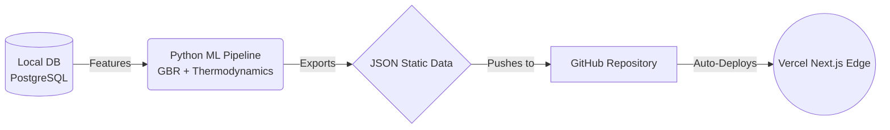

# 🌍 Global AQ Intelligence

<!-- BLOCK 1: TL;DR -->


> **An enterprise-grade, weather-aware PM2.5 forecasting engine predicting air quality for 4 countries using Gradient Boosting & Thermodynamics.**

`Python` | `Next.js` | `PostgreSQL` | `XGBoost/GBR` | `Open-Meteo API`

---

<!-- BLOCK 2: Why it's God-Tier -->
## ⚡ Why it's God-Tier
- **Zero-Data Leakage Pipeline:** Chronological Holdout Validation system. Ensures models never see "future" temporal data during training, providing honest, production-ready accuracy metrics rather than overfit illusions.
- **Thermodynamics Engine:** A custom physics-based 'Weather-Weighted Interpolator' that dynamically bends predictions by applying mathematical logic for rain washouts (30% reduction) and wind dispersion (15% reduction).
- **Cost-Optimized Architecture:** A Local-Compute to Edge-CDN deployment strategy. ML training and heavy database crunching run locally (zero cloud cost), exporting ultra-lightweight static JSONs that are automatically deployed to a free Vercel Edge network.

---

<!-- BLOCK 3: Architecture Diagram -->
## 🏛️ Architecture Flow

*(Data Flow: Local DB -> Python ML Pipeline -> JSON -> GitHub -> Vercel Next.js)*

---

<!-- BLOCK 4: The Deep Dive -->
## 🔬 The Deep Dive (For Tech Leads)

### Project Journey & Mathematical Evolution


What started as a simple local EDA project evolved into a robust, global MLOps architecture over 7 major iterations:

- **Phase 1-3:** Data Cleaning & Context. Discovered that standard time-series models leak data without chronological splitting. Replaced Open-Meteo historicals with NASA POWER due to null-rate issues.
- **Phase 4:** Temporal Memory Breakthrough. Discovered that yesterday's PM2.5 (`lag_1`) carries 76% of the signal. Boosted R² from 0.31 to 0.97 by adding historical memory variables.
- **Phase 5:** Global Expansion. Scaled the architecture to support disparate environments (Indian Monsoons, Australian Bushfires, UK Maritime, USA Regulated AQI).
- **Phase 6:** The Chaining Problem. Our 30-day chained forecast compounded errors rapidly (day 2 fed into day 3, etc.).
- **Phase 7 (Current): V7 Direct Thermodynamics Engine:** 
  - Developed independent models targeting specific horizons (`1d`, `7d`, `14d`, and `30d`). 
  - Eradicated exponential error compounding.
  - Deployed an Anchor Point strategy augmented with a physics-based Weather-Weighted Interpolator.

### Performance Benchmarks (Global V7 Test Metrics)
*Evaluated on a strict 20% temporal split:*

| Country | R² | MAE | Environment |
|---------|-----|-----|-------------|
| 🇺🇸 USA | 0.80 | 1.7 µg/m³ | Reference-grade sensors, stable baseline |
| 🇮🇳 India | 0.75 | 9.26 µg/m³ | High-variance seasonal spikes (Stubble burning/Monsoon) |
| 🇦🇺 Australia | 0.64 | 1.6 µg/m³ | Clean air, low variance |
| 🇬🇧 UK | 0.48 | 2.0 µg/m³ | Fragmented local sensors |

### Honest ML Quirks & Future Work
While the pipeline is production-ready, there are a few ML quirks we are actively tracking:
- **Physics-Backed Persistence at h1:** For India (and others), `value` (today's PM2.5) holds ~82% feature importance for the 1-day forecast. The `h1` model essentially says "tomorrow ≈ today, adjusted for season and weather." This is a reasonable, physics-backed baseline. For `h7` and `h30`, features like `roll_3_mean` and `day_of_year` correctly take over the signal.
- **US Medium-Range Weakness:** The US `h7` and `h14` R² scores are weak. A single country-level GBR model for 1,400 US stations across wildly different geographies (coast, desert, industrial midwest) is too coarse. The seasonality signal (`day_of_year`) carries the `h30` model. **Future fix:** Train regional sub-models or per-station models for the US.
- **Overfit on IN h30:** The India 30-day model shows a high train R² (0.88) vs test R² (0.43). It memorizes winter pollution spikes but struggles to generalize them. **Future fix:** Increase regularization (`min_samples_leaf` up to 20-25, `max_depth` down to 4) or gather more seasonal training data.

### How to Run Locally

1. **Database Setup:**
   Ensure PostgreSQL is running locally (`brew services start postgresql@15`).
   ```bash
   createdb indiaaq
   ```
2. **Install Dependencies:**
   ```bash
   python3 -m venv venv
   source venv/bin/activate
   pip install -r requirements.txt
   ```
3. **Run the Admin Dashboard (Retrain & Deploy):**
   ```bash
   uvicorn scripts.admin_dashboard:app --reload
   ```
   Navigate to `http://localhost:8000/admin`. From here, you can trigger data fetching, forecast generation, model retraining, and Vercel frontend deployments directly.

> **Note to Reviewers:** For detailed logs on how we overcame extreme Next.js caching barriers, temporal data leakage, and algorithmic forecasting errors, please refer to the [`ISSUES.md`](./ISSUES.md) document.
