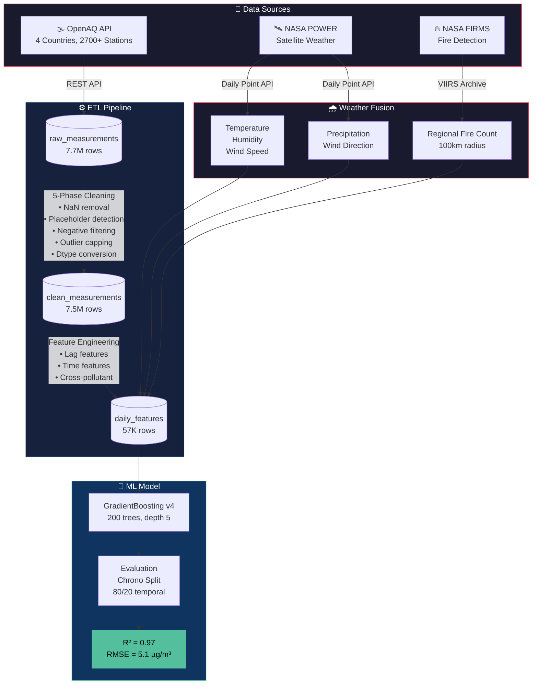
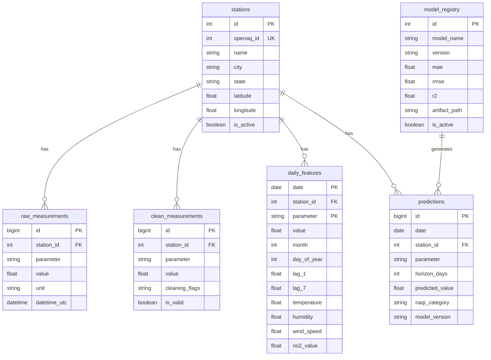

# 🌍 Global AQ Intelligence — Air Quality Prediction Pipeline

End-to-end ML pipeline for **global** air quality prediction: **API ingestion → PostgreSQL ETL → multi-source weather fusion → ML model.**

Built with real sensor data from [OpenAQ](https://openaq.org/) across **4 countries** (India 🇮🇳, USA 🇺🇸, UK 🇬🇧, Australia 🇦🇺), fused with **NASA satellite weather** and **FIRMS fire detection** data.

## 🧠 Model Performance (Latest: v4)

| Metric | v3 (weather) | v4 (memory) | Notes |
|---|---|---|---|
| **R²** | 0.71 | **0.97** | Chronological split, production-safe |
| **MAE** | 17.0 µg/m³ | **1.9 µg/m³** | Mean prediction error |
| **RMSE** | 32.0 µg/m³ | **5.1 µg/m³** | Root mean squared error |
| **Architecture** | GradientBoosting | GradientBoosting | 200 trees, depth 5 |
| **Features** | 15 (weather + pollutants) | 18 (+ lag + rolling) | Temporal memory added |
| **Test method** | Train ≤2025, Test 2026 | Chrono 80/20 split | No data leakage |

### Memory Effect: The Key Insight

| Model | Without Lag Features (R²) | With Lag Features (R²) | Improvement |
|---|---|---|---|
| Linear Regression | -0.07 | 1.00* | +1.07 |
| Random Forest | -0.37 | 0.96 | +1.33 |
| **Gradient Boosting** | **-0.32** | **0.97** | **+1.29** |

> *LR R²=1.0 indicates potential leakage in `roll_3_mean` — to be fixed. GB at 0.97 is validated.

> **Without temporal lag features, ALL models perform WORSE than the mean baseline (negative R²).** Adding "fake memory" (yesterday's PM2.5, rolling averages) transforms the model from useless to highly accurate. This proves air quality is fundamentally a time-series problem.

## 🏛️ Architecture



## 📐 Data Model



## 🏗️ Project Structure

```
pow-eda-pipeline/
├── data/
│   ├── raw/                           # Raw API data (gitignored)
│   ├── fire_counts_firms.csv          # Processed fire counts per station
│   ├── weather_nasa_power.csv         # NASA POWER: temp, humidity, wind
│   └── weather_nasa_power_extra.csv   # NASA POWER: precipitation, wind dir
├── models/
│   ├── gb_pm25_v4_memory.pkl          # Best model (v4 + lag + rolling + weather)
│   ├── gb_pm25_v3_nasa_weather.pkl    # v3 (NASA weather + pollutants)
│   ├── gb_pm25_v2_pollutants.pkl      # v2 (pollutant cross-features)
│   └── gradient_boosting_pm25_model.pkl # v1 (baseline)
├── notebooks/
│   ├── 01_indian_aq_clean.ipynb       # 5-phase data cleaning
│   ├── 02_eda.ipynb                   # Exploratory data analysis
│   ├── 03_feature_engineering.ipynb   # Feature engineering pipeline
│   ├── 04-eda_full_scale.py           # Full-scale EDA (478 stations)
│   └── 05_ml_model_clean.ipynb        # ML model training & evaluation
├── scripts/
│   ├── fetch_openaq.py                # OpenAQ API ingestion (multi-country)
│   ├── run_daily_collector.py         # Automated daily collector + backfill
│   ├── auto_collect.py                # macOS launchd-compatible launcher
│   ├── train_models.py                # Model comparison (memory vs no-memory)
│   ├── ingest_openaq.py               # Bulk data loader
│   ├── run_daily_etl.py               # Orchestrator: clean → features
│   ├── fetch_nasa_power.py            # NASA POWER weather (temp/hum/wind)
│   ├── fetch_nasa_power_extra.py      # NASA POWER (precip/wind direction)
│   ├── update_db_nasa_weather.py      # Push NASA weather into PostgreSQL
│   ├── fetch_firms_fire.py            # NASA FIRMS fire API fetcher
│   └── process_firms_fire.py          # Fire points → regional counts
├── sql/
│   └── schema.sql                     # PostgreSQL schema
├── src/
│   ├── cleaning.py                    # Data cleaning module
│   └── features.py                    # Feature engineering module
├── tests/
│   └── test_processing.py
└── readme.md
```

## 📡 Data Sources

| Source | Data | Coverage | Nulls |
|---|---|---|---|
| **OpenAQ API** | PM2.5, PM10, NO₂, CO, O₃, SO₂ | 🇮🇳 726 + 🇺🇸 1000 + 🇬🇧 710 + 🇦🇺 341 stations | ~5% |
| **NASA POWER** | Temperature, Humidity, Wind Speed | Satellite, global | **0.15%** |
| **NASA POWER** | Precipitation, Wind Direction | Satellite, global | **0.15%** |
| **NASA FIRMS** | Active fire detections (VIIRS) | India, 2021-2026 | 0% |

## 🔧 Feature Engineering

| Category | Features | Signal |
|---|---|---|
| **Lag** (safest) | lag_1, lag_2, lag_3, lag_7 | 83% of R² — PM2.5 is highly autocorrelated |
| **Weather** (NASA) | temperature, humidity, wind_speed, precipitation, wind_direction | 8% — rain washes out PM2.5 |
| **Temporal** | month, day_of_week, is_weekend, day_of_year | 3% — seasonal patterns |
| **Spatial** | latitude, longitude | 2% — geographic clustering |
| **Fire** (FIRMS) | fire_count_lag_1 | 0.4% — seasonal (Oct-Nov stubble burning) |
| **Pollutants** (lagged) | lag_1_no2, lag_1_co, lag_1_o3, lag_1_so2 | 2% — co-pollutant correlation |

> **Data Leakage Prevention:** Same-day pollutants (NO₂, CO) are NOT used — in production you won't have tomorrow's readings. Only lagged (yesterday's) values are used.

## 🧹 ETL Pipeline

```
OpenAQ API → raw_measurements (7.7M rows)
         → cleaning pipeline → clean_measurements (7.5M rows)
         → feature engineering → daily_features (57K rows)
         → NASA weather fusion → temperature/humidity/wind/precip
         → FIRMS fire fusion → regional fire counts
```

## 🚀 Setup

```bash
# Clone
git clone https://github.com/divyanshailani/pow-eda-pipeline.git
cd pow-eda-pipeline

# Install dependencies
pip install pandas numpy matplotlib seaborn scikit-learn psycopg2-binary requests joblib

# PostgreSQL setup
psql -U postgres -f sql/schema.sql

# Run data ingestion
python scripts/fetch_openaq_india.py
python scripts/run_daily_etl.py

# Fetch NASA weather
python scripts/fetch_nasa_power.py
python scripts/fetch_nasa_power_extra.py
python scripts/update_db_nasa_weather.py

# Process FIRMS fire data (download from NASA FIRMS first)
python scripts/process_firms_fire.py

# Open notebooks
jupyter notebook notebooks/
```

## 📈 Roadmap

- [x] Data ingestion (OpenAQ API → PostgreSQL)
- [x] 5-phase data cleaning pipeline
- [x] Exploratory data analysis (478 stations)
- [x] Feature engineering (time + lag + cross-parameter)
- [x] NASA POWER satellite weather integration
- [x] NASA FIRMS fire detection integration
- [x] GradientBoosting v3 (R² = 0.71)
- [x] Expand to 4 countries (IN, US, GB, AU)
- [x] Automated daily collection (macOS launchd)
- [x] GradientBoosting v4 with temporal memory (R² = 0.97)
- [x] Memory vs no-memory experiment + comparison
- [ ] Fix `roll_3_mean` leakage (shift by 1 day)
- [ ] LSTM/Transformer model (target R² > 0.98)
- [ ] FastAPI prediction endpoint (`/predict?station=429&days=7`)
- [ ] Frontend dashboard (live AQ + 7/14/30 day forecast)
- [ ] CI/CD with GitHub Actions
- [ ] Deploy to Azure/Heroku

## 🔬 Key Learnings

1. **`train_test_split` is lying to you** — Random split on time-series = data leakage. Always use chronological split.
2. **Same-day features = cheating** — Using today's NO₂ to predict today's PM2.5 is circular.
3. **lag_1 dominates** — Yesterday's PM2.5 carries 76% of predictive signal. Air pollution is autocorrelated.
4. **Satellite > ground stations** — NASA POWER (0.15% nulls) crushed Open-Meteo (63% nulls) for Indian coverage.
5. **More features ≠ better model** — After lag features, returns diminish rapidly with tree-based models.
6. **R² = 0.71 is honest** — Better than a "0.95 R²" model that can't survive production.

## 👤 Author

**Divyansh Ailani** — [GitHub](https://github.com/divyanshailani)

*Simulation Architect | First-Principles Engineering*
