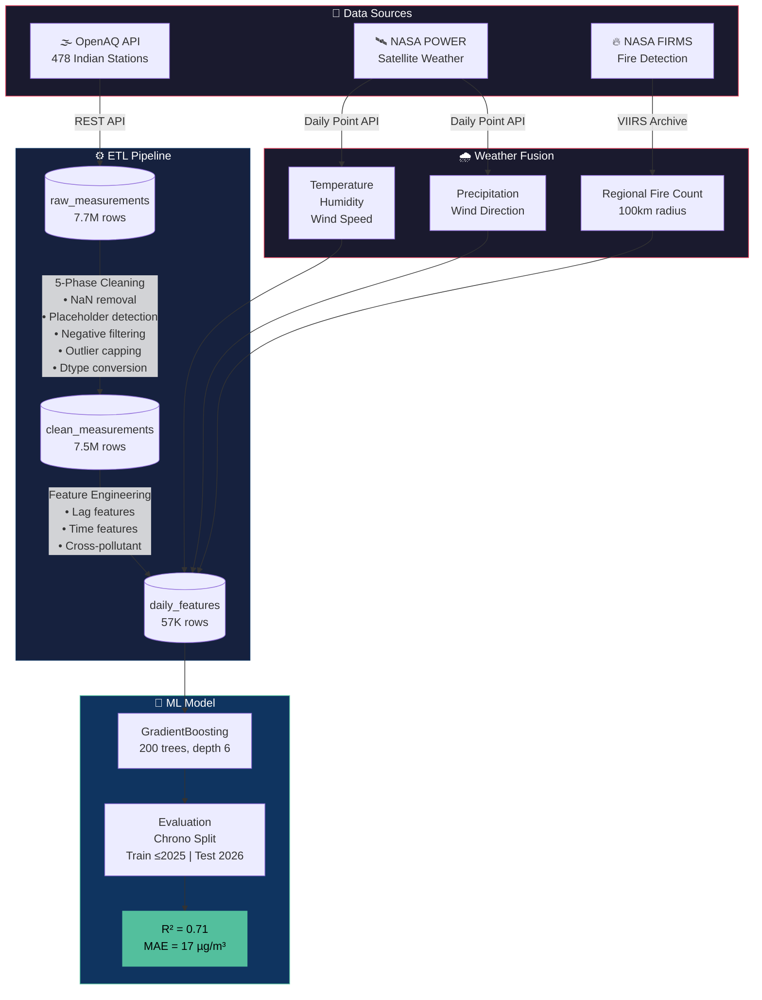

# 🇮🇳 IndiaAQ Intelligence — Air Quality Prediction Pipeline

End-to-end ML pipeline for Indian air quality prediction: **API ingestion → PostgreSQL ETL → multi-source weather fusion → ML model.**

Built with real sensor data from [OpenAQ](https://openaq.org/) across **478 Indian monitoring stations** (2021–2026), fused with **NASA satellite weather** and **FIRMS fire detection** data.

## 🧠 Model Performance

| Metric | Value | Notes |
|---|---|---|
| **R²** | **0.71** | Chronological split, production-safe |
| **MAE** | 17.0 µg/m³ | Mean prediction error |
| **RMSE** | 32.0 µg/m³ | Root mean squared error |
| **Architecture** | GradientBoosting | 200 trees, depth 6 |
| **Test method** | Train ≤2025, Test 2026 | No data leakage |

> **Why R² = 0.71 is honest:** Most Kaggle notebooks show 0.95+ using random `train_test_split` on time-series data — that's data leakage. Our model uses chronological split with lagged-only features, meaning no future information leaks into training.

## 🏛️ Architecture



## 📐 Data Model

```mermaid
erDiagram
    stations ||--o{ raw_measurements : "has"
    stations ||--o{ clean_measurements : "has"
    stations ||--o{ daily_features : "has"
    stations ||--o{ predictions : "has"
    model_registry ||--o{ predictions : "generates"

    stations {
        serial id PK
        int openaq_id UK
        text name
        text city
        text state
        float latitude
        float longitude
        bool is_active
    }

    raw_measurements {
        bigserial id PK
        int station_id FK
        text parameter
        float value
        text unit
        timestamptz datetime_utc
    }

    clean_measurements {
        bigserial id PK
        int station_id FK
        text parameter
        float value
        text[] cleaning_flags
        bool is_valid
    }

    daily_features {
        date date PK
        int station_id PK_FK
        text parameter PK
        float value
        smallint month
        smallint day_of_year
        float lag_1
        float lag_7
        float temperature
        float humidity
        float wind_speed
        float no2_value
    }

    predictions {
        bigserial id PK
        date date
        int station_id FK
        text parameter
        smallint horizon_days
        float predicted_value
        text naqi_category
        text model_version
    }

    model_registry {
        serial id PK
        text model_name
        text version
        float mae
        float rmse
        float r2
        text artifact_path
        bool is_active
    }
```

## 🏗️ Project Structure

```
pow-eda-pipeline/
├── data/
│   ├── raw/                           # Raw API data (gitignored)
│   ├── fire_counts_firms.csv          # Processed fire counts per station
│   ├── weather_nasa_power.csv         # NASA POWER: temp, humidity, wind
│   └── weather_nasa_power_extra.csv   # NASA POWER: precipitation, wind dir
├── models/
│   ├── gb_pm25_v3_nasa_weather.pkl    # Best model (v3 + NASA weather)
│   └── gradient_boosting_pm25_model.pkl
├── notebooks/
│   ├── 01_indian_aq_clean.ipynb       # 5-phase data cleaning
│   ├── 02_eda.ipynb                   # Exploratory data analysis
│   ├── 03_feature_engineering.ipynb   # Feature engineering pipeline
│   ├── 04-eda_full_scale.py           # Full-scale EDA (478 stations)
│   └── 05_ml_model_clean.ipynb        # ML model training & evaluation
├── scripts/
│   ├── fetch_openaq_india.py          # OpenAQ API ingestion
│   ├── ingest_openaq.py               # Bulk data loader
│   ├── run_daily_etl.py               # Orchestrator: clean → features
│   ├── fetch_nasa_power.py            # NASA POWER weather (temp/hum/wind)
│   ├── fetch_nasa_power_extra.py      # NASA POWER (precip/wind direction)
│   ├── update_db_nasa_weather.py      # Push NASA weather into PostgreSQL
│   ├── fetch_firms_fire.py            # NASA FIRMS fire API fetcher
│   └── process_firms_fire.py          # Fire points → regional counts
├── sql/
│   └── schema.sql                     # PostgreSQL schema
├── src/
│   ├── cleaning.py                    # Data cleaning module
│   └── features.py                    # Feature engineering module
├── tests/
│   └── test_processing.py
└── readme.md
```

## 📡 Data Sources

| Source | Data | Coverage | Nulls |
|---|---|---|---|
| **OpenAQ API** | PM2.5, PM10, NO₂, CO, O₃, SO₂ | 478 stations, 2021-2026 | ~5% |
| **NASA POWER** | Temperature, Humidity, Wind Speed | Satellite, global | **0.15%** |
| **NASA POWER** | Precipitation, Wind Direction | Satellite, global | **0.15%** |
| **NASA FIRMS** | Active fire detections (VIIRS) | India, 2021-2026 | 0% |

## 🔧 Feature Engineering

| Category | Features | Signal |
|---|---|---|
| **Lag** (safest) | lag_1, lag_2, lag_3, lag_7 | 83% of R² — PM2.5 is highly autocorrelated |
| **Weather** (NASA) | temperature, humidity, wind_speed, precipitation, wind_direction | 8% — rain washes out PM2.5 |
| **Temporal** | month, day_of_week, is_weekend, day_of_year | 3% — seasonal patterns |
| **Spatial** | latitude, longitude | 2% — geographic clustering |
| **Fire** (FIRMS) | fire_count_lag_1 | 0.4% — seasonal (Oct-Nov stubble burning) |
| **Pollutants** (lagged) | lag_1_no2, lag_1_co, lag_1_o3, lag_1_so2 | 2% — co-pollutant correlation |

> **Data Leakage Prevention:** Same-day pollutants (NO₂, CO) are NOT used — in production you won't have tomorrow's readings. Only lagged (yesterday's) values are used.

## 🧹 ETL Pipeline

```
OpenAQ API → raw_measurements (7.7M rows)
         → cleaning pipeline → clean_measurements (7.5M rows)
         → feature engineering → daily_features (57K rows)
         → NASA weather fusion → temperature/humidity/wind/precip
         → FIRMS fire fusion → regional fire counts
```

## 🚀 Setup

```bash
# Clone
git clone https://github.com/divyanshailani/pow-eda-pipeline.git
cd pow-eda-pipeline

# Install dependencies
pip install pandas numpy matplotlib seaborn scikit-learn psycopg2-binary requests joblib

# PostgreSQL setup
psql -U postgres -f sql/schema.sql

# Run data ingestion
python scripts/fetch_openaq_india.py
python scripts/run_daily_etl.py

# Fetch NASA weather
python scripts/fetch_nasa_power.py
python scripts/fetch_nasa_power_extra.py
python scripts/update_db_nasa_weather.py

# Process FIRMS fire data (download from NASA FIRMS first)
python scripts/process_firms_fire.py

# Open notebooks
jupyter notebook notebooks/
```

## 📈 Roadmap

- [x] Data ingestion (OpenAQ API → PostgreSQL)
- [x] 5-phase data cleaning pipeline
- [x] Exploratory data analysis (478 stations)
- [x] Feature engineering (time + lag + cross-parameter)
- [x] NASA POWER satellite weather integration
- [x] NASA FIRMS fire detection integration
- [x] GradientBoosting model (R² = 0.71, production-safe)
- [ ] LSTM/Transformer model (target R² > 0.85)
- [ ] FastAPI prediction endpoint
- [ ] Frontend dashboard

## 🔬 Key Learnings

1. **`train_test_split` is lying to you** — Random split on time-series = data leakage. Always use chronological split.
2. **Same-day features = cheating** — Using today's NO₂ to predict today's PM2.5 is circular.
3. **lag_1 dominates** — Yesterday's PM2.5 carries 76% of predictive signal. Air pollution is autocorrelated.
4. **Satellite > ground stations** — NASA POWER (0.15% nulls) crushed Open-Meteo (63% nulls) for Indian coverage.
5. **More features ≠ better model** — After lag features, returns diminish rapidly with tree-based models.
6. **R² = 0.71 is honest** — Better than a "0.95 R²" model that can't survive production.

## 👤 Author

**Divyansh Ailani** — [GitHub](https://github.com/divyanshailani)

*Simulation Architect | First-Principles Engineering*
